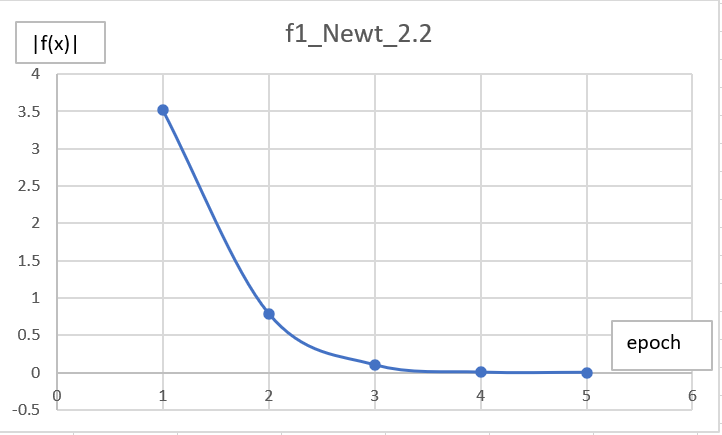
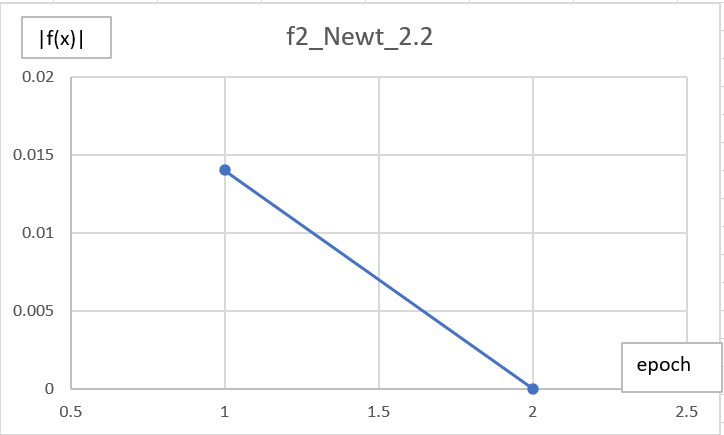

# 实验报告

徐海阳 PB20000326

## 实验结果

本实验选用了$f(x)=(x-1)^3-x^2+x$ 和 $f(x)=sin^3(x)+cos^3(x)$两个函数。

### 二分法

二分法直接用求根区间作为输入。

实验输出如下图。

### 牛顿法

Newton法尝试了三个初始值，2.2、2.5和2.8作为输入 。

实验输出如下图。

可以看出，不同的初始值作为输入，输出的解直到小数点后六位都是一样的。

## 结果分析

### 二分法

开始时稍有波动，但迅速收敛。

### 牛顿法

与二分法相比，整体收敛趋势几乎没有波动。

不同的初始值确实会影响收敛的速度快慢。

如，$f_1(x)$在$x=2.2$时需要5轮迭代才能收敛，而在$x=2.5$和$x=2.8$时都只需要3轮迭代即可收敛。$f_2(x)$在$x=2.8$时需要4轮迭代才能收敛，而在$x=2.2$和$x=2.5$都只需要2轮迭代即可收敛。

