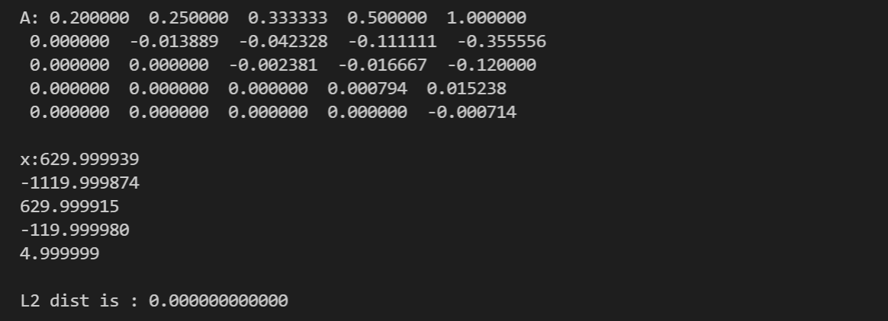
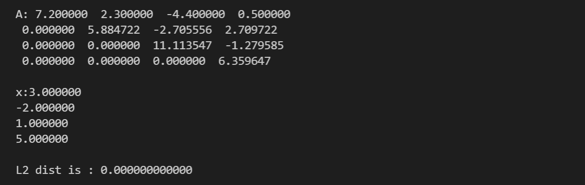
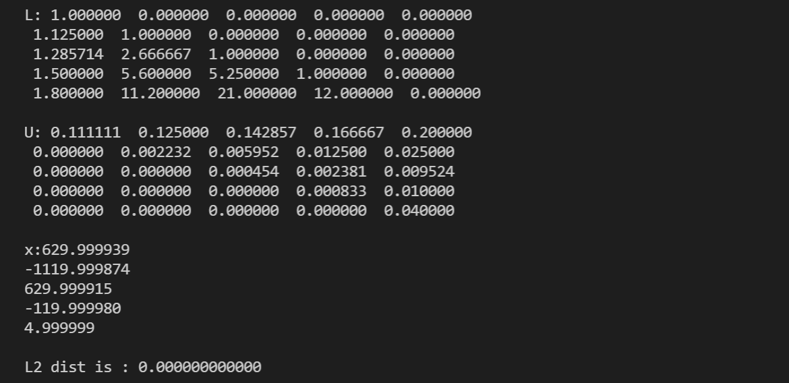
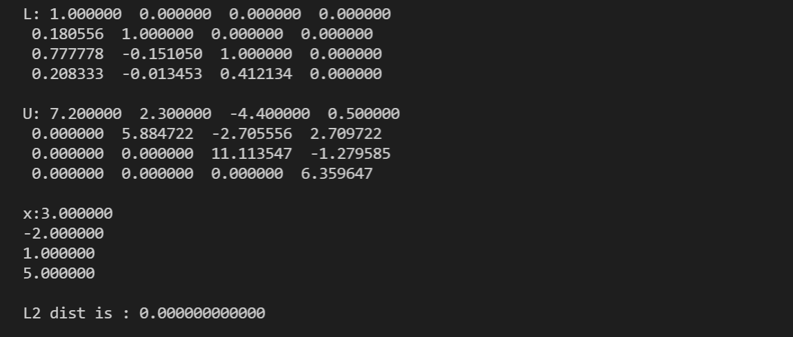

# Lab2 Report

​																			徐海阳 PB20000326

## 实验结果

### Gauss列主元消元

方程1：包括消元后得到的上三角阵、方程组的解$x$、误差$|Ax-b|$

方程2：包括消元后得到的上三角阵、方程组的解$x$、误差$|Ax-b|$

### Doolittle

方程1：包括分解后的上下三角矩阵$L,U$、方程组的解$x$、误差$|Ax-b|$

方程2：包括分解后的上下三角矩阵$L,U$、方程组的解$x$、误差$|Ax-b|$

## 结果分析

两种方法的误差在12位精度下都为0。

运行效果都不错。

