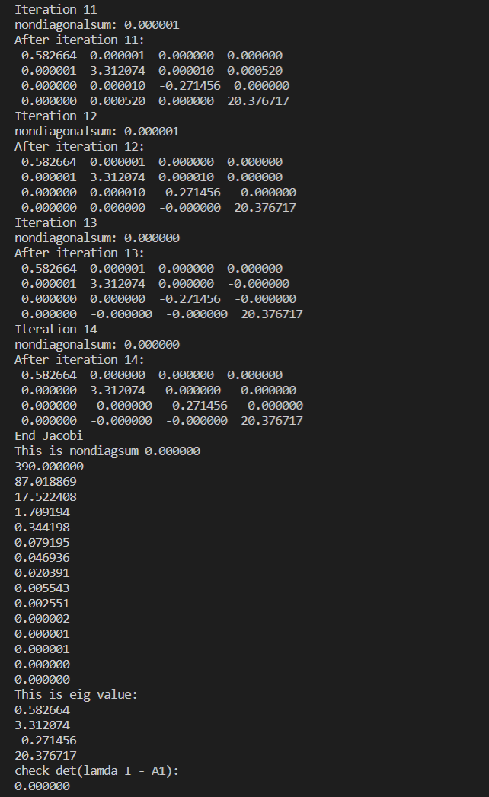
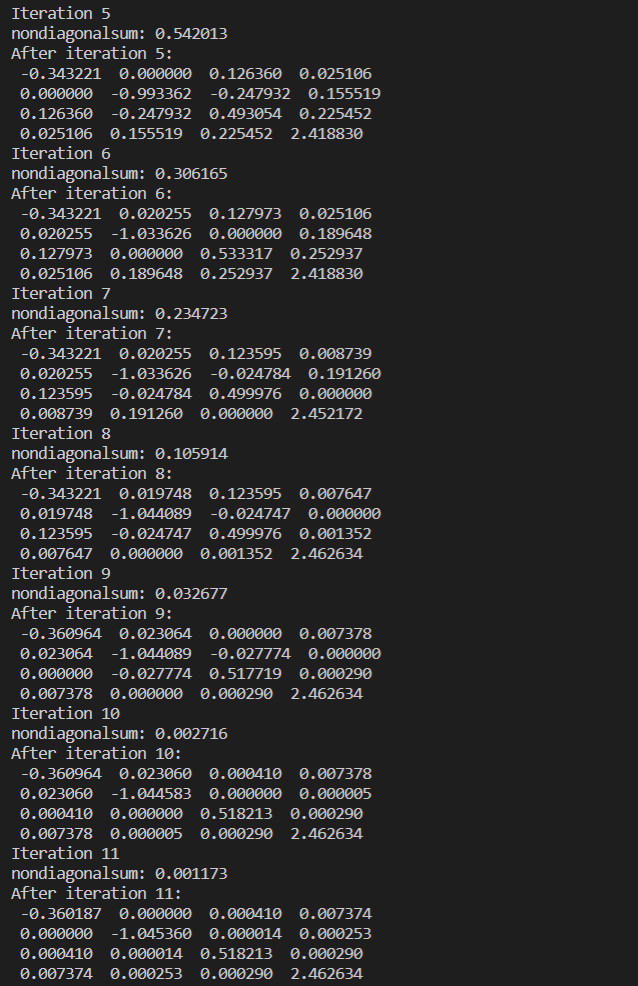

# Lab4 Report

​																	徐海阳 PB20000326

## 实验结果

### A1

### A2

## 结果分析

1. 矩阵初始值：图中`Ai`

    迭代后的矩阵：图中`After iteration iter`

    每次迭代后的非对角元素和：图中`This is nondiagsum `

    计算得到的特征值：图中`This is eig value`

2. 平方和：图中`This is nondiagsum`确实呈下降趋势

    特征值：图中`check det(lamda I - A)`在要求精度范围内为0，可认为即为A的特征值
