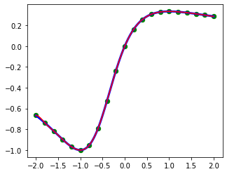
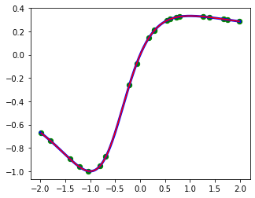
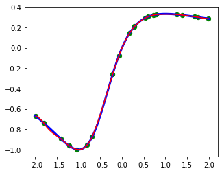
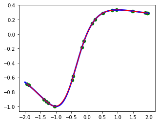
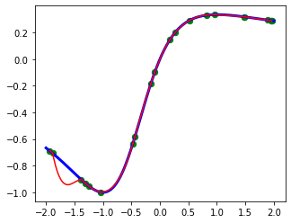
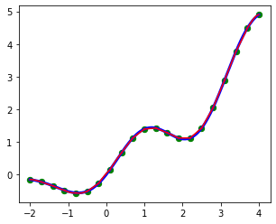
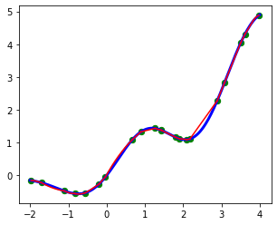

# Lab5 Report

​																	徐海阳 PB20000326

## 实验结果

### 函数1

均匀、自然

均匀、一阶导数

随机1、自然

随机1、一阶导数

随机2、自然

随机2、一阶导数

### 函数2

均匀、自然

均匀、一阶导数

随机1、自然

随机1、一阶导数

随机2、自然

随机2、一阶导数

## 结果分析

1. 均匀采样情况下拟合效果很好
2. 随机采样情况下，若两个点之间距离较大，则可能出现一定偏差