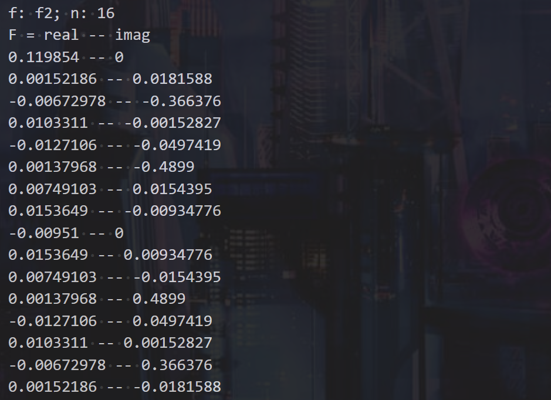
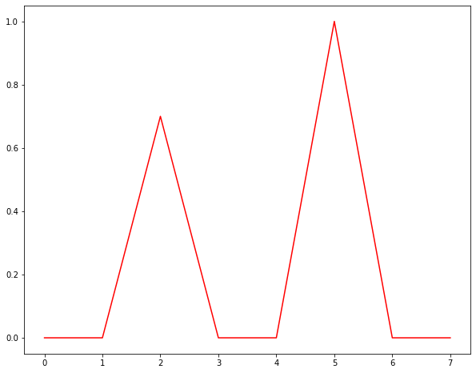

# Lab6 Report

​																	徐海阳 PB20000326

## 实验结果

### 要求1

#### 1. f1，n=16


#### 2. f2, n=16



#### 3. f1, n=128

```txt
F = real -- imag
9.94942e-018 -- 0
4.60206e-018 -- 2.34187e-017
-1.95025e-017 -- -0.35
1.99682e-017 -- 3.36381e-017
1.11669e-017 -- 4.67666e-017
-2.52288e-016 -- -0.5
1.97098e-017 -- -1.12316e-016
3.13875e-017 -- -5.47805e-017
1.67357e-017 -- -7.1156e-017
1.00213e-017 -- -2.06139e-017
2.49459e-017 -- -4.45039e-017
3.47931e-017 -- -1.72599e-017
5.1475e-017 -- -5.47011e-017
-1.31255e-017 -- 5.50586e-017
-2.93485e-017 -- -2.79461e-017
-3.50927e-017 -- -1.07364e-018
-1.45434e-017 -- -6.08056e-018
8.58805e-018 -- -1.26446e-017
3.59869e-017 -- -4.06322e-017
2.10824e-017 -- 8.26567e-019
4.02872e-017 -- -3.67946e-017
3.49283e-017 -- 9.15726e-017
-5.70109e-018 -- 1.78441e-017
-1.16469e-017 -- 1.0435e-017
-3.85811e-017 -- -4.20874e-017
3.25196e-017 -- 1.5768e-017
-5.07253e-017 -- 2.32666e-017
-4.39436e-017 -- 4.20296e-017
-9.69667e-017 -- -1.90439e-017
1.36343e-017 -- -1.32882e-016
1.15546e-016 -- -2.55668e-017
-6.36669e-018 -- 3.44988e-017
-3.38523e-017 -- -1.86483e-017
1.50502e-017 -- 8.34161e-018
-3.16839e-017 -- -4.3031e-017
1.06737e-017 -- 1.528e-018
-5.46887e-017 -- -1.77047e-017
-7.50809e-018 -- 1.97704e-017
-9.59331e-017 -- -2.60182e-017
9.70239e-018 -- -1.41584e-016
9.99284e-017 -- -3.26591e-017
2.05949e-017 -- 1.47676e-017
1.45083e-017 -- -2.61244e-017
1.29713e-017 -- 1.85274e-017
-8.76435e-018 -- -1.28715e-017
-1.01175e-017 -- -1.19037e-017
-3.14961e-017 -- -2.73568e-018
2.66681e-017 -- -5.50958e-017
1.79624e-017 -- -4.34584e-018
-1.57057e-017 -- 2.56896e-018
3.65894e-017 -- -2.69877e-017
3.08817e-017 -- 2.85464e-018
5.21889e-018 -- 1.492e-017
1.61217e-017 -- -3.34149e-018
-4.94343e-017 -- -3.75472e-017
4.88862e-017 -- -5.53381e-017
8.14106e-017 -- -3.39722e-017
-1.71555e-017 -- -6.7188e-018
6.60439e-017 -- 3.3283e-018
9.96825e-017 -- 0
5.20697e-017 -- -1.72185e-017
-1.88226e-017 -- -1.10855e-018
1.21801e-016 -- 2.77556e-017
3.08841e-017 -- 2.84576e-017
-1.0194e-016 -- 0
3.08028e-017 -- -2.85814e-017
8.45809e-017 -- -2.77556e-017
-1.03312e-017 -- 1.38479e-018
5.20697e-017 -- 1.72185e-017
-2.48748e-018 -- -2.77556e-017
6.60086e-017 -- 6.02208e-018
-1.32986e-017 -- 1.75929e-017
8.14106e-017 -- 3.39722e-017
4.10328e-017 -- 5.52113e-017
-5.51142e-017 -- 3.76922e-017
2.25231e-017 -- 2.33794e-017
5.21889e-018 -- -1.492e-017
3.40925e-017 -- -1.98565e-017
4.10886e-017 -- 3.5285e-017
-1.432e-017 -- 3.84187e-018
1.79624e-017 -- 4.34584e-018
2.69833e-017 -- 5.45749e-017
-3.67428e-017 -- 9.74048e-018
-3.47919e-018 -- 1.34805e-017
-8.76435e-018 -- 1.28715e-017
-1.48999e-018 -- -1.44382e-017
2.43167e-017 -- 3.46865e-017
1.33449e-017 -- -9.55756e-018
9.99284e-017 -- 3.26591e-017
9.13474e-018 -- 1.40392e-016
-8.88183e-017 -- 2.28463e-017
3.51417e-017 -- 6.89927e-017
-5.46887e-017 -- 1.77047e-017
-4.29643e-018 -- -1.03132e-017
-3.78348e-018 -- 5.33224e-017
9.35388e-018 -- -6.64827e-018
-3.38523e-017 -- 1.86483e-017
-8.601e-018 -- -3.47203e-017
8.28845e-017 -- -1.24802e-017
9.99131e-018 -- 1.21373e-016
-9.69667e-017 -- 1.90439e-017
-5.2978e-017 -- -4.7526e-017
-4.56475e-017 -- -1.9214e-017
3.44575e-017 -- -1.66713e-017
-3.85811e-017 -- 4.20874e-017
-1.52919e-017 -- -1.65583e-017
-3.9513e-018 -- -1.6135e-017
5.08868e-017 -- -2.46469e-017
4.02872e-017 -- 3.67946e-017
1.83904e-017 -- -1.26587e-017
3.5114e-017 -- 5.0908e-017
8.45978e-018 -- 5.19546e-018
-1.45434e-017 -- 6.08056e-018
-1.67954e-017 -- -2.35053e-018
-3.05767e-017 -- 3.01238e-017
-2.97212e-018 -- -3.6308e-017
5.1475e-017 -- 5.47011e-017
-3.9988e-018 -- -1.82818e-017
3.41302e-017 -- 5.32764e-017
1.03234e-017 -- 4.69751e-017
1.67357e-017 -- 7.1156e-017
2.87091e-017 -- 5.69452e-017
2.03577e-017 -- 1.10652e-016
-5.80329e-016 -- 0.5
1.11669e-017 -- -4.67666e-017
1.58561e-017 -- -6.06247e-017
-1.9045e-016 -- 0.35
8.88681e-018 -- -5.60478e-017
```

#### 4. f2, n=128

```
F = real -- imag
0.143107 -- 0
0.00187938 -- 0.00268744
0.00267645 -- -0.348646
0.00488804 -- -0.00248569
-0.00467526 -- -0.0026808
0.000589321 -- -0.498161
-0.00251315 -- -0.000560426
0.0011079 -- 0.00295675
0.00558547 -- -0.00163341
-0.00917617 -- -0.000257836
-0.00256976 -- 0.00153821
-0.00549256 -- 0.00702468
0.000498506 -- -0.000851348
0.00997216 -- -0.000908006
-0.00425551 -- 0.00486802
0.00180805 -- 0.0019427
0.00716683 -- -0.000294131
0.0100905 -- 0.0051679
-0.00505288 -- -0.00936389
-0.000495666 -- 0.0124931
-0.000290171 -- 0.000884943
-0.00195536 -- 0.00343202
-0.000140856 -- 0.00824235
0.000316282 -- 0.00877058
-0.00704804 -- 0.00315842
0.0112456 -- 0.000257035
0.00276913 -- 0.000816558
0.0127883 -- 0.0101644
0.00560368 -- -0.00661781
-0.00209114 -- -0.00172312
-0.0061626 -- -0.00474
0.00914131 -- -0.00248013
0.0018818 -- -0.0102417
0.00411084 -- 0.0128701
0.00797246 -- -0.00321505
-6.99053e-005 -- 0.0049174
0.00183396 -- -0.000867816
-0.00183569 -- -0.0143468
0.00960872 -- 0.000167602
0.00532924 -- -0.00353333
0.00285184 -- -0.00520431
0.00483501 -- -0.000290004
-0.000936775 -- 0.00714803
0.00491823 -- -0.000274849
0.00284172 -- 0.00762973
-0.010106 -- 0.00349628
7.53712e-005 -- 0.00450569
-0.00169544 -- 0.00395168
0.00391723 -- -7.70999e-005
0.000264643 -- 0.00305836
-0.00471481 -- -0.000166737
0.00840665 -- 0.00894311
-0.00829115 -- -0.00649664
0.00612536 -- 0.00182183
0.00373226 -- 0.00186152
0.00321379 -- -0.00242421
-0.000155522 -- -0.000229271
0.00474445 -- 0.00191508
-0.00343211 -- -0.000616092
-0.00528551 -- -0.00143966
0.00839433 -- 0.00447349
0.00534593 -- 0.00528963
-0.0135259 -- 0.00250383
-0.00257512 -- -0.0041256
0.00510773 -- 0
-0.00257512 -- 0.0041256
-0.0135259 -- -0.00250383
0.00534593 -- -0.00528963
0.00839433 -- -0.00447349
-0.00528551 -- 0.00143966
-0.00343211 -- 0.000616092
0.00474445 -- -0.00191508
-0.000155522 -- 0.000229271
0.00321379 -- 0.00242421
0.00373226 -- -0.00186152
0.00612536 -- -0.00182183
-0.00829115 -- 0.00649664
0.00840665 -- -0.00894311
-0.00471481 -- 0.000166737
0.000264643 -- -0.00305836
0.00391723 -- 7.70999e-005
-0.00169544 -- -0.00395168
7.53712e-005 -- -0.00450569
-0.010106 -- -0.00349628
0.00284172 -- -0.00762973
0.00491823 -- 0.000274849
-0.000936775 -- -0.00714803
0.00483501 -- 0.000290004
0.00285184 -- 0.00520431
0.00532924 -- 0.00353333
0.00960872 -- -0.000167602
-0.00183569 -- 0.0143468
0.00183396 -- 0.000867816
-6.99053e-005 -- -0.0049174
0.00797246 -- 0.00321505
0.00411084 -- -0.0128701
0.0018818 -- 0.0102417
0.00914131 -- 0.00248013
-0.0061626 -- 0.00474
-0.00209114 -- 0.00172312
0.00560368 -- 0.00661781
0.0127883 -- -0.0101644
0.00276913 -- -0.000816558
0.0112456 -- -0.000257035
-0.00704804 -- -0.00315842
0.000316282 -- -0.00877058
-0.000140856 -- -0.00824235
-0.00195536 -- -0.00343202
-0.000290171 -- -0.000884943
-0.000495666 -- -0.0124931
-0.00505288 -- 0.00936389
0.0100905 -- -0.0051679
0.00716683 -- 0.000294131
0.00180805 -- -0.0019427
-0.00425551 -- -0.00486802
0.00997216 -- 0.000908006
0.000498506 -- 0.000851348
-0.00549256 -- -0.00702468
-0.00256976 -- -0.00153821
-0.00917617 -- 0.000257836
0.00558547 -- 0.00163341
0.0011079 -- -0.00295675
-0.00251315 -- 0.000560426
0.000589321 -- 0.498161
-0.00467526 -- 0.0026808
0.00488804 -- 0.00248569
0.00267645 -- 0.348646
0.00187938 -- -0.00268744
```

### 要求2

#### 1. f1, n=16



#### 2. f1, n=128


#### 3. f2, n=16


#### 4. f2, n=128


### 要求3

#### 1. n=16

(完全重合)


#### 2. n=128

(完全重合)


### 要求4

#### 1. n=16


#### 2. n=128


## 结果分析

1. n越大，折线图拟合原图的效果就越好；不会对重建质量产生影响
2. f2中去掉高频系数后，拟合曲线更为光滑平缓，很多尖刺和剧烈起伏的地方都被去掉了