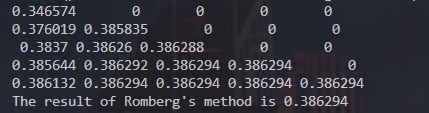
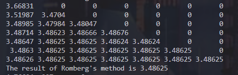
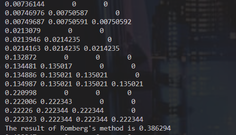
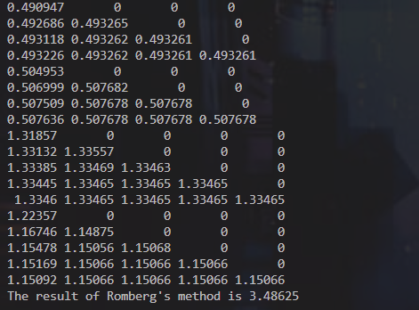
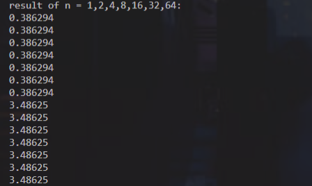

# Lab7 Report

​																	徐海阳 PB20000326

## 实验结果

### f1, n=1

### f2, n=1

### f1, n=4

由于n>1时递归，故打印了多个矩阵，所有的矩阵对应位置的元素加起来就是正常的矩阵

### f2, n=4

由于n>1时递归，故打印了多个矩阵，所有的矩阵对应位置的元素加起来就是正常的矩阵

## 结果分析

不同的n对结果没有影响